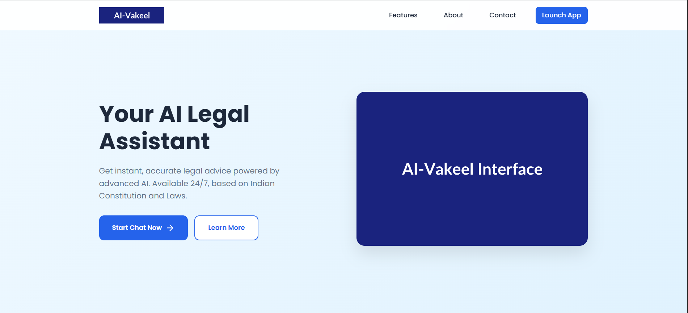
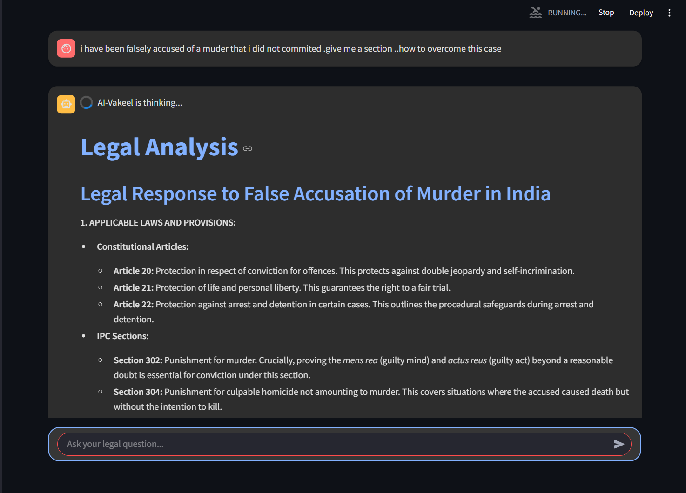

# AI-Vakeel

## Your AI Legal Assistant for Indian Law

AI-Vakeel is an advanced AI-powered legal assistant designed to provide comprehensive legal information, case studies, and guidance on Indian law. It leverages large language models and vector search to deliver accurate and contextual legal responses.

## 📄 Research Publication

This project is backed by in-depth academic research. You can read the full research paper published in the *International Journal of Scientific Research in Engineering and Management (IJSREM)*:

🔗 [AI-Vakeel: An AI-Powered Platform for Smart Legal Query Resolution in the Indian Judiciary (IJSREM)](https://ijsrem.com/download/ai-vakeel-an-ai-powered-platform-for-smart-legal-query-resolution-in-the-indian-judiciary/)


## Screenshots

Here's a preview of AI-Vakeel in action:

### Landing Page


_Welcome to AI-Vakeel - Your AI Legal Assistant for Indian Law_


_Easy access to comprehensive legal assistance_

### Login Interface


_Secure login to access your personal legal assistant_

### Chat Interface


_AI-Vakeel providing detailed legal information with proper citations_

### Message Interface


_Intuitive messaging interface for legal queries_

### Response Interface


_Get detailed legal responses with proper citations_


_Comprehensive answers to complex legal questions_

## Features

- **Legal Information Retrieval**: Access information on Constitutional articles, IPC/CrPC sections, and legal amendments
- **Case Law Analysis**: Find relevant case studies and landmark judgments with proper citations
- **Procedural Guidance**: Get step-by-step guidance on legal procedures and documentation requirements
- **Rights & Remedies**: Understand fundamental rights and available legal remedies
- **User Account System**: Create profiles, save and manage chat sessions
- **Vector Search**: Efficiently search through legal documents and case studies
- **Citation Validation**: Automatic verification of legal citations and references

## Technology Stack

- **Frontend**: Streamlit
- **AI Models**: Google Generative AI (Gemini)
- **Vector Database**: FAISS
- **Framework**: LangChain
- **Database**: SQLite
- **Authentication**: Custom session management

## Installation

1. Clone the repository:

   ```bash
   git clone https://github.com/yourusername/AI-Vakeel.git
   cd AI-Vakeel
   ```

2. Install dependencies:

   ```bash
   pip install -r requirements.txt
   pip install langchain-google-genai  # Required dependency
   ```

3. Set up environment variables:
   Create a `.env` file in the project root with:

   ```
   GOOGLE_API_KEY=your_google_api_key
   ```

4. Initialize the vector database:
   ```bash
   python rebuild_legal_db.py
   ```

## Usage

1. Launch the application:

   ```bash
   streamlit run Vakeel.py
   ```

2. Access the web interface at http://localhost:8501

3. Create an account or log in to start using the AI legal assistant

4. Enter your legal queries and receive detailed responses with appropriate citations

## Project Structure

```
AI-Vakeel/
├── Vakeel.py              # Main application file
├── ingest.py              # PDF ingestion script
├── rebuild_legal_db.py    # Database initialization script
├── data/                  # Data files and utilities
│   └── dummy_data.py      # Sample data for testing
├── dataset/               # Legal documents and case studies
│   ├── case_studies/      # Case law PDFs
│   └── legal_documents/   # Legal reference PDFs
├── Faiss/                 # Vector database files
├── sessions/              # User chat sessions
├── assets/                # Images and media files
│   └── screenshots/       # Application screenshots
└── utils/                 # Utility functions
    └── session_manager.py # User session management
```

## Troubleshooting

### Common Issues

- **ModuleNotFoundError: No module named 'langchain_google_genai'**: Install the missing module with `pip install langchain-google-genai`
- **Legal database not properly loaded**: Run `python rebuild_legal_db.py` to create a minimal working database
- **Missing module error**: Ensure all dependencies are installed with `pip install -r requirements.txt`
- **Google API key errors**: Verify your API key is correctly set in the `.env` file or directly in the code

## Contribution

Contributions are welcome! Please feel free to submit a Pull Request.

1. Fork the repository
2. Create your feature branch (`git checkout -b feature/amazing-feature`)
3. Commit your changes (`git commit -m 'Add some amazing feature'`)
4. Push to the branch (`git push origin feature/amazing-feature`)
5. Open a Pull Request

## License

This project is licensed under the MIT License - see the LICENSE file for details.

## Acknowledgments

- Built for legal assistance in the Indian context
- Uses Google's Gemini models for generating responses
- Integrates FAISS for efficient vector search
- Powered by LangChain framework

---

**Disclaimer**: AI-Vakeel is designed to provide legal information and guidance, not legal advice. For specific legal advice, please consult a qualified lawyer.
